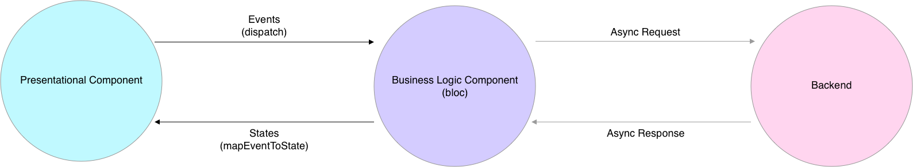

# Flutter BLoC Application

A new and very cool Flutter application, built with the BLoC architecture.

 ‏‏‎ 

## Resources

### Flutter

- [Lab: Write your first Flutter app](https://flutter.io/docs/get-started/codelab)
- [Cookbook: Useful Flutter samples](https://flutter.io/docs/cookbook)

### BLoC

- [Flutter Login Tutorial with “flutter_bloc”](https://medium.com/flutter-community/flutter-login-tutorial-with-flutter-bloc-ea606ef701ad)
- [Flutter Bloc package documentation](https://pub.dartlang.org/packages/flutter_bloc)
- [BLoC documentation](https://felangel.github.io/bloc/#/gettingstarted)
- [Flutter Architecture Examples](https://github.com/brianegan/flutter_architecture_samples)
